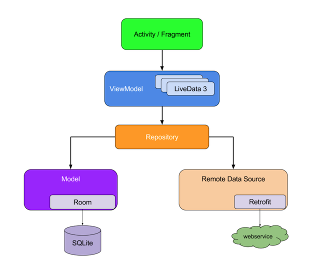

#### 一、介绍
#### 1.1 Android Architecture Components 介绍

Android Architecture Components 是谷歌在Google I/O 2017发布一套帮助开发者解决Android 架构设计的方案。里面包含了两大块内容：

* 生命周期相关的 Lifecycle-aware Components
* 数据库解决方案 Room

#### 1.2 主要架构

* Lifecycle

生命周期管理，把原先Android生命周期的中的代码抽取出来，如将原先需要在onStart()等生命周期中执行的代码分离到Activity或者Fragment之外。

* LiveData

一个数据持有类，持有数据并且这个数据可以被观察被监听，和其他Observer不同的是，它是和Lifecycle是绑定的，在生命周期内使用有效，减少内存泄露和引用问题。

* ViewModel

代替 persenter 的角色，生命周期长于 activity / fragment ，一种新的保存数据的方式。同时是与Lifecycle绑定的，使用者无需担心生命周期。可以在多个Fragment之间共享数据，比如旋转屏幕后Activity会重新create，这时候使用ViewModel还是之前的数据，不需要再次请求网络数据。

* Room

Google 推出的一个Sqlite ORM库，不过使用起来还不错，使用注解，极大简化数据库的操作，有点类似Retrofit的风格。

通过这几个 API 我们可以搭建一套基于事件的 app 架构出来，LiveData 和其他一些 API 可以简单的看做是 Google 版的 RXJAVA ，只不过是针对 android 系统的，功能上也是很简单，没有 RXJAVA 那么强大的变换和线程控制。但是这正是我们所需要的，因为有了 RXJAVA ，我们在复杂的业务场景中用 RXJAVA 就好了，LiveData 使用简单，学习成本低，我们用来搭建基于数据流的响应式架构体系的 app 是最合适的。



#### 1.3 通用的架构准则
最重要的一个原则就是尽量在app中做到separation of concerns（关注点分离）。常见的错误就是把所有代码都写在Activity或者Fragment中。任何跟UI和系统交互无关的事情都不应该放在这些类当中。尽可能让它们保持简单轻量可以避免很多生命周期方面的问题。

第二个很重要的准则是用model驱动UI，最好是持久化的model。之所以要持久化是基于两个原因：如果OS销毁app释放资源，用户数据不会丢失；当网络很差或者断网的时候app可以继续工作。Model是负责app数据处理的组件。它们不依赖于View或者app 组件（Activity，Fragment等），因此它们不会受那些组件的生命周期的影响。保持UI代码的简单，于业务逻辑分离可以让它更易管理。

#### 1.4 添加依赖
[官网](https://developer.android.com/topic/libraries/architecture/adding-components)

```
allprojects {
        repositories {
            jcenter()
            maven { url 'https://maven.google.com' }  //添加此行
            //google()
        }
    }    
``` 
#### Androidx库

从v28开始, android的support库将会进行改进, 28.0.0将会是support库的终结版本. 未来新的特性和改进都会进入Androidx包.

给出了一个新旧库名和类名称对应的列表
https://developer.android.com/topic/libraries/support-library/refactor

#### Lifecycle

Dependencies for Lifecycle, including LiveData and ViewModel.


```
dependencies {
    def lifecycle_version = "2.0.0"

    // ViewModel and LiveData
    implementation "androidx.lifecycle:lifecycle-extensions:$lifecycle_version"
    // alternatively - just ViewModel
    implementation "androidx.lifecycle:lifecycle-viewmodel:$lifecycle_version" // use -ktx for Kotlin
    // alternatively - just LiveData
    implementation "androidx.lifecycle:lifecycle-livedata:$lifecycle_version"
    // alternatively - Lifecycles only (no ViewModel or LiveData). Some UI
    //     AndroidX libraries use this lightweight import for Lifecycle
    implementation "androidx.lifecycle:lifecycle-runtime:$lifecycle_version"

    annotationProcessor "androidx.lifecycle:lifecycle-compiler:$lifecycle_version" // use kapt for Kotlin
    // alternately - if using Java8, use the following instead of lifecycle-compiler
    implementation "androidx.lifecycle:lifecycle-common-java8:$lifecycle_version"

    // optional - ReactiveStreams support for LiveData
    implementation "androidx.lifecycle:lifecycle-reactivestreams:$lifecycle_version" // use -ktx for Kotlin

    // optional - Test helpers for LiveData
    testImplementation "androidx.arch.core:core-testing:$lifecycle_version"
}
```

Android 页面生命周期加强，把页面的生命周期变成一个 Observable ，这个 Observable 我们无法直接使用，而是配合注解写在需要 hook 生命周期的位置，最大的好处就是脱离了 callback 或是 Proxy 代理类，在代码上灵活太多了，Lifecycle 会扫描所有代码中有标记的方法，然后注册给生命周期的 Observable 对象里面去。AAC 这个基于事件的架构是学起来最通透的，一切都是 Observable / Observer，都是观察者和被观察者的关系，一切都是基于注册的方式运行。

既然一切都是 Observable / Observer 的，那么管理页面生命周期的 Observable / Observer 哪里来呢，这就要说到 LifecycleActivity / LifecycleFragment 了，我是用 API 26做基准编译代码的，AppCompatActivity / V4 包下的 Fragment 都已经兼容了 AAC 架构了，所以 LifecycleActivity / LifecycleFragment 过时了


获取 Observable Lifecycle 被观察者

```
Lifecycle lifecycle = getLifecycle();

```

Observer 呢，我们直接 new 一个 LifecycleObserver 对象出来也行，或是某个类实现这个接口也行，最后注册到 Observable 就行

观察者实现LifecycleObserver 接口

[Handling Lifecycles](https://juejin.im/post/5937e1c8570c35005b7b262a)


