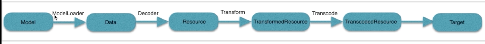

### 流程分析
#### Model 数据加载来源
url、id、本地文件等
#### Data
加工成原始数据，输入流
#### Resource
解码后的资源bitmap
#### TransfomedResource
对resource进行变换 裁剪
#### TranscodedResource
转码操作，类型统一
#### Target
显示在的目标



#### with方法
Glide.with(this) //随着作用域停止加载<br>

```
 public static RequestManager with(Context context) {
        RequestManagerRetriever retriever = RequestManagerRetriever.get();
        return retriever.get(context);
    }
```
with 将图片加载和组件的生命周期相挂钩<br>
with方法会返回RequestManager请求管理类<br>
RequestManagerRetriever 生产RequestManager类<br>

```
 public RequestManager get(Context context) {
        if (context == null) { //判断上下文是否为null
            throw new IllegalArgumentException("You cannot start a load on a null Context");
        } else if (Util.isOnMainThread() && !(context instanceof Application)) {//对上下文类型进行判断
            if (context instanceof FragmentActivity) {
                return get((FragmentActivity) context);
            } else if (context instanceof Activity) {
                return get((Activity) context);
            } else if (context instanceof ContextWrapper) {
                return get(((ContextWrapper) context).getBaseContext());
            }
        }
        //上下文是application 
        return getApplicationManager(context);
    }
```

**getApplicationManager(context)方法：**

```
    private RequestManager getApplicationManager(Context context) {
        // 全局上下文或者子线程中 实例化RequestManager对象
                if (applicationManager == null) {
            synchronized (this) {
                if (applicationManager == null) {
                    // Normally pause/resume is taken care of by the fragment we add to the fragment or activity.
                    // However, in this case since the manager attached to the application will not receive lifecycle
                    // events, we must force the manager to start resumed using ApplicationLifecycle.
                    applicationManager = new RequestManager(context.getApplicationContext(),
                            new ApplicationLifecycle(), new EmptyRequestManagerTreeNode());
                }
            }
        }

        return applicationManager;
    }
```
**get方法上下文分为非application和application**

传入的为非application（Activity activity）:

```
 @TargetApi(Build.VERSION_CODES.HONEYCOMB)
    public RequestManager get(Activity activity) {
        if (Util.isOnBackgroundThread() || Build.VERSION.SDK_INT < Build.VERSION_CODES.HONEYCOMB) {
            return get(activity.getApplicationContext());
        } else {
            assertNotDestroyed(activity);
            android.app.FragmentManager fm = activity.getFragmentManager();
            //如果是ui线程
            return fragmentGet(activity, fm);
        }
    }
```

**fragmentGet(activity, fm)方法**

```
//获取一个空的Fragment对象RequestManagerFragment 绑定到activity监听当前activity的声明周期
  @TargetApi(Build.VERSION_CODES.HONEYCOMB)
    RequestManager fragmentGet(Context context, android.app.FragmentManager fm) {
        RequestManagerFragment current = getRequestManagerFragment(fm);
        //返回RequestManagerFragment中的RequestManager对象
        RequestManager requestManager = current.getRequestManager();  
        if (requestManager == null) {
            requestManager = new RequestManager(context, current.getLifecycle(), current.getRequestManagerTreeNode());
            //将组件与requestManager进行绑定
            current.setRequestManager(requestManager);
        }
        return requestManager;
    }
```
****
   
     