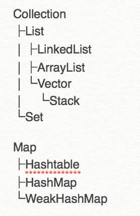
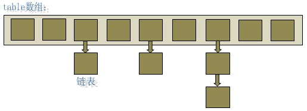
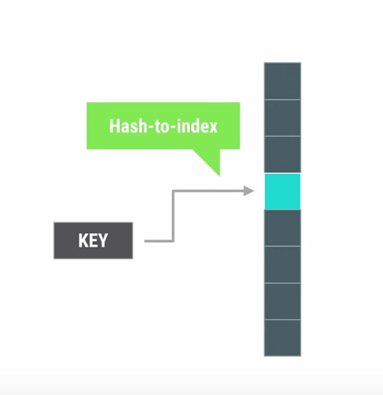
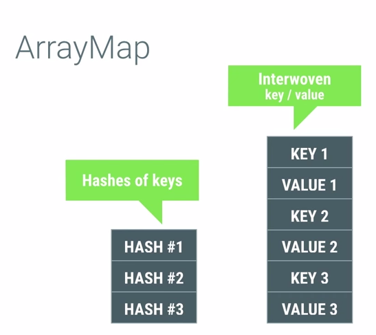
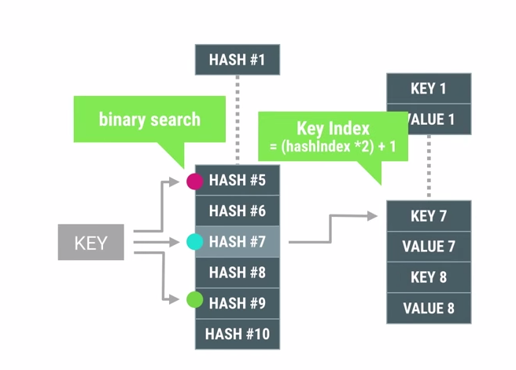

### 接口的意义
规范、扩展、回调<br>
你写接口你写实现，就不用写接口了。
我写接口你实现，接口不就用上了。我不给你规定好了，你怎么知道该实现哪些内容呢。更进一步，我写接口你实现，你今天不在，我明天出差，程序后天交工，那我今天必须把调用这个接口的代码写好。所以就需要接口中有函数，有明确的函数签名。我写个接口，再把调用函数写好，明天你把接口实现了，传个实例进来，交工。
interface换个叫法就是contract，有点合同的意思。A实现了这个接口，代表A承诺能做某些事情。B需要一些能做某些事情的东西，于是B要求，必须实现了A接口，才能被我调用。实际上也就是个“规范”。

### 抽象类的意义
为其子类提供一个公共的类型 封装子类中得重复内容 定义抽象方法，子类虽然有不同的实现 但是定义是一致的。

### 内部类的作用 
[链接](http://www.cnblogs.com/chenssy/p/3388487.html)
**可以将一个类的定义放在另一个类的定义内部，这就是内部类。**<br>
1. 完善多重继承

```
public interface Father {
}
public interface Mother {
}
public class Son implements Father, Mother {
}
public class Daughter implements Father{
    class Mother_ implements Mother{ 
    }
}
```
2.实现事件驱动系统、闭包。<br>

《Think in java》中提到<br>
1.内部类可以用多个实例，每个实例都有自己的状态信息，并且与其他外围对象的信息相互独立。<br>
2.在单个外围类中，可以让多个内部类以不同的方式实现同一个接口，或者继承同一个类。<br>
3.创建内部类对象的时刻并不依赖于外围类对象的创建。<br>
4.内部类并没有令人迷惑的“is-a”关系，他就是一个独立的实体。<br>
5.内部类提供了更好的封装，除了该外围类，其他类都不能访问。<br>

#### 基础使用
**内部类如何使用外部类的属性和方法，以及使用.this与.new**

```
public class OuterClass {
    private String name ;
    private int age;
    
    /**省略getter和setter方法**/
    public class InnerClass{
        public InnerClass(){
            name = "chenssy";
            age = 23;
        }
        public void display(){
            System.out.println("name：" + getName() +"   ;age：" + getAge());
        }
    }
    public static void main(String[] args) {
        OuterClass outerClass = new OuterClass();
        OuterClass.InnerClass innerClass = outerClass.new InnerClass();
        innerClass.display();
    }
}
```
可以看到内部了InnerClass可以对外围类OuterClass的属性进行无缝的访问，尽管它是private修饰的。这是因为当我们在创建某个外围类的内部类对象时，此时内部类对象必定会捕获一个指向那个外围类对象的引用，只要我们在访问外围类的成员时，就会用这个引用来选择外围类的成员。<br>

生成对外部类对象的引用，可以使用OuterClassName.this，这样就能够产生一个正确引用外部类的引用了。

```
public class OuterClass {
    public void display(){
        System.out.println("OuterClass...");
    }
    
    public class InnerClass{
        public OuterClass getOuterClass(){
            return OuterClass.this;  //返回外部对象实例
        }
    }
    
    public static void main(String[] args) {
        OuterClass outerClass = new OuterClass();
        OuterClass.InnerClass innerClass = outerClass.new InnerClass();
        innerClass.getOuterClass().display();
    }
}
```
内部类是个编译时的概念，一旦编译成功后，它就与外围类属于两个完全不同的类（当然他们之间还是有联系的）。对于一个名为OuterClass的外围类和一个名为InnerClass的内部类，在编译成功后，会出现这样两个class文件：OuterClass.class和OuterClass$InnerClass.class。

#### 分类
**在Java中内部类主要分为成员内部类、局部内部类、匿名内部类、静态内部类。**<br>
成员内部类也是最普通的内部类，它是外围类的一个成员，所以他是可以无限制的访问外围类的所有 成员属性和方法，尽管是private的，但是外围类要访问内部类的成员属性和方法则需要通过内部类实例来访问。<br>
**注意：**<br>
第一：成员内部类中不能存在任何static的变量和方法；<br>
第二：成员内部类是依附于外围类的，所以只有先创建了外围类才能够创建内部类。
#### 静态内部类
静态内部类与非静态内部类之间存在一个最大的区别，我们知道非静态内部类在编译完成之后会隐含地保存着一个引用，该引用是指向创建它的外围内，但是静态内部类却没有。没有这个引用就意味着：<br>
1、 它的创建是不需要依赖于外围类的。<br>
2、 它不能使用任何外围类的非static成员变量和方法。<br>

```
public class OuterClass {
    private String sex;
    public static String name = "chenssy";
    
    /**
     *静态内部类
     */
    static class InnerClass1{
        /* 在静态内部类中可以存在静态成员 */
        public static String _name1 = "chenssy_static";
        
        public void display(){
            /* 
             * 静态内部类只能访问外围类的静态成员变量和方法
             * 不能访问外围类的非静态成员变量和方法
             */
            System.out.println("OutClass name :" + name);
        }
    }
    
    /**
     * 非静态内部类
     */
    class InnerClass2{
        /* 非静态内部类中不能存在静态成员 */
        public String _name2 = "chenssy_inner";
        /* 非静态内部类中可以调用外围类的任何成员,不管是静态的还是非静态的 */
        public void display(){
            System.out.println("OuterClass name：" + name);
        }
    }
    
    /**
     * @desc 外围类方法
     * @author chenssy
     * @data 2013-10-25
     * @return void
     */
    public void display(){
        /* 外围类访问静态内部类：内部类. */
        System.out.println(InnerClass1._name1);
        /* 静态内部类 可以直接创建实例不需要依赖于外围类 */
        new InnerClass1().display();
        
        /* 非静态内部的创建需要依赖于外围类 */
        OuterClass.InnerClass2 inner2 = new OuterClass().new InnerClass2();
        /* 方位非静态内部类的成员需要使用非静态内部类的实例 */
        System.out.println(inner2._name2);
        inner2.display();
    }
    
    public static void main(String[] args) {
        OuterClass outer = new OuterClass();
        outer.display();
    }
}
----------------
Output:
chenssy_static
OutClass name :chenssy
chenssy_inner
OuterClass name：chenssy
```
从字面上看，一个被称为静态嵌套类，一个被称为内部类。从字面的角度解释是这样的：什么是嵌套？嵌套就是我跟你没关系，自己可以完全独立存在，但是我就想借你的壳用一下，来隐藏一下我自己（真TM猥琐）。什么是内部？内部就是我是你的一部分，我了解你，我知道你的全部，没有你就没有我。（所以内部类对象是以外部类对象存在为前提的）


### 父类的静态方法能否被子类重写
**重载：**在类中可以创建多个方法，它们具有相同的名字，但具有不同的参数和不同的定义，无法以返回型别作为重载函数的区分标准。<br>
**重写：**父类与子类之间的多态性，对父类的函数进行重新定义。如果在子类中定义某方法与其父类有相同的名称和参数。有时子类并不想原封不动地继承父类的方法，而是想作一定的修改，这就需要采用方法的重写。
方法重写又称方法覆盖。<br>
**不能**<br>
因为静态方法从程序开始运行后就已经分配了内存，也就是说已经写死了。所有引用到该方法的对象（父类的对象也好子类的对象也好）所指向的都是同一块内存中的数据，也就是该静态方法。子类中如果定义了相同名称的静态方法，并不会重写，而应该是在内存中又分配了一块给子类的静态方法，没有重写这一说。

### java排序算法
[链接](http://blog.csdn.net/qy1387/article/details/7752973)

### 列举java的集合和继承关系


### java虚拟机的特性
**特点:** Java语言的一个非常重要的特点就是与平台的无关性。而使用Java虚拟机是实现这一特点的关键。<br>
**对比高级语言:** 一般高级语言要想在不同平台运行，至少需要生成不同目标代码。而java虚拟机屏蔽了与具体系统平台信息，只要编译生成在java虚拟机运行的字节码，就可以在多种平台运行，不需要重复编译。<br>
**解释字节码:** Java虚拟机在执行字节码时，把字节码解释成具体平台上的机器指令执行。<br>

### 哪些情况下的对象会被垃圾回收机制处理掉
Java 垃圾回收机制最基本的做法是分代回收。内存中的区域被划分成不同的世代，对象根据其存活的时间被保存在对应世代的区域中。一般的实现是划分成3个世代：年轻、年老和永久。内存的分配是发生在年轻世代中的。当一个对象存活时间足够长的时候，它就会被复制到年老世代中。对于不同的世代可以使用不同的垃圾回收算法。进行世代划分的出发点是对应用中对象存活时间进行研究之后得出的统计规律。一般来说，一个应用中的大部分对象的存活时间都很短。比如局部变量的存活时间就只在方法的执行过程中。基于这一点，对于年轻世代的垃圾回收算法就可以很有针对性。

### 进程和线程的区别
进程和线程的主要差别在于它们是不同的操作系统资源管理方式。进程有独立的地址空间，一个进程崩溃后，在保护模式下不会对其它进程产生影响，而线程只是一个进程中的不同执行路径。线程有自己的堆栈和局部变量，但线程之间没有单独的地址空间，一个线程死掉就等于整个进程死掉，所以多进程的程序要比多线程的程序健壮，但在进程切换时，耗费资源较大，效率要差一些。*但对于一些要求同时进行并且又要共享某些变量的并发操作，只能用线程，不能用进程。*<br>
1) 简而言之,一个程序至少有一个进程,一个进程至少有一个线程.<br>
2) 线程的划分尺度小于进程，使得多线程程序的并发性高。<br>
3) 另外，进程在执行过程中拥有独立的内存单元，而多个线程共享内存，从而极大地提高了程序的运行效率。<br>
4) 线程在执行过程中与进程还是有区别的。每个独立的线程有一个程序运行的入口、顺序执行序列和程序的出口。但是线程不能够独立执行，必须依存在应用程序中，由应用程序提供多个线程执行控制。<br>
5) 从逻辑角度来看，多线程的意义在于一个应用程序中，有多个执行部分可以同时执行。但操作系统并没有将多个线程看做多个独立的应用，来实现进程的调度和管理以及资源分配。这就是进程和线程的重要区别。<br>
4.优缺点<br>
线程和进程在使用上各有优缺点：线程执行开销小，但不利于资源的管理和保护；而进程正相反。同时，线程适合于在SMP机器上运行，而进程则可以跨机器迁移。

### java中==和equals和hashCode的区别
[链接](http://blog.csdn.net/tiantiandjava/article/details/46988461)
在java中：<br>
==是运算符，用于比较两个变量是否相等。<br>
equals，是Objec类的方法，用于比较两个对象是否相等，默认Object类的equals方法是比较两个对象的地址，跟==的结果一样。Object的equals方法如下：

```
public boolean equals(Object obj) {  
    return (this == obj);  
}  
```
hashCode也是Object类的一个方法。返回一个离散的int型整数。在集合类操作中使用，为了提高查询速度。（HashMap，HashSet等）<br>
有了这三个基础概念，区别就简单了。<br>
java中的数据类型，可分为两类： <br>
1.基本数据类型，也称原始数据类型。byte,short,char,int,long,float,double,boolean 
  他们之间的比较，应用双等号（==）,比较的是他们的值。 <br>
2.复合数据类型(类) <br>
  当他们用（==）进行比较的时候，比较的是他们在内存中的存放地址，所以，除非是同一个new出来的对象，他们的比较后的结果为true，否则比较后结果为false。 JAVA当中所有的类都是继承于Object这个基类的，在Object中的基类中定义了一个equals的方法，这个方法的初始行为是比较对象的内存地址，但在一些类库当中这个方法被覆盖掉了，如String,Integer,Date在这些类当中equals有其自身的实现，而不再是比较类在堆内存中的存放地址了。
  对于复合数据类型之间进行equals比较，在没有覆写equals方法的情况下，他们之间的比较还是基于他们在内存中的存放位置的地址值的，因为Object的equals方法也是用双等号（==）进行比较的，所以比较后的结果跟双等号（==）的结果相同。<br>
如果两个对象根据equals()方法比较是相等的，那么调用这两个对象中任意一个对象的hashCode方法都必须产生同样的整数结果。<br>
如果两个对象根据equals()方法比较是不相等的，那么调用这两个对象中任意一个对象的hashCode方法，则不一定要产生相同的整数结果<br>
**从而在集合操作的时候有如下规则：**
将对象放入到集合中时，首先判断要放入对象的hashcode值与集合中的任意一个元素的hashcode值是否相等，如果不相等直接将该对象放入集合中。如果hashcode值相等，然后再通过equals方法判断要放入对象与集合中的任意一个对象是否相等，如果equals判断不相等，直接将该元素放入到集合中，否则不放入。
回过来说get的时候，HashMap也先调key.hashCode()算出数组下标，然后看equals如果是true就是找到了，所以就涉及了equals。
### HashMap的实现原理
[链接](http://zhangshixi.iteye.com/blog/672697) <br>
1.HashMap概述：<br> 无序、非同步、可null
   HashMap是基于哈希表的Map接口的非同步实现。此实现提供所有可选的映射操作，并允许使用null值和null键。此类不保证映射的顺序，特别是它不保证该顺序恒久不变。 <br>
2.HashMap的数据结构：<br>
   在java编程语言中，最基本的结构就是两种，一个是数组，另外一个是模拟指针（引用），所有的数据结构都可以用这两个基本结构来构造的，HashMap也不例外。HashMap实际上是一个“链表散列”的数据结构，即数组和链表的结合体。


```
transient Entry[] table;  
static class Entry<K,V> implements Map.Entry<K,V> {  
    final K key;  
    V value;  
    Entry<K,V> next;  
    final int hash;  
    ……  
} 
```
   可以看出，Entry就是数组中的元素，每个 Map.Entry 其实就是一个key-value对，它持有一个指向下一个元素的引用，这就构成了链表。

### int-char-long各占多少字节数

类型         | 位数  | 字节数     |
--------------------|------------------|-----------------------|
byte        | 8     |   1
short       | 16    |   2
int         | 32    |   4
long        | 64    |   8
float       | 32    |   4
double      | 64    |   8
char        | 16    |   2
   
### int与integer的区别
1.int是基本的数据类型，Integer是int的封装类；<br>
2.int和Integer都可以表示某一个数值；<br>
3.int和Integer不能够互用，因为他们两种不同的数据类型；<br>
4.在类进行初始化时int类的变量初始为0.而Integer的变量则初始化为null.

### string-stringbuffer-stringbuilder区别
String 字符串常量<br>
StringBuffer 字符串变量（线程安全）<br>
StringBuilder 字符串变量（非线程安全）<br>
简要的说， String 类型和 StringBuffer 类型的主要性能区别其实在于 String 是不可变的对象, 因此在每次对 String 类型进行改变的时候其实都等同于生成了一个新的 String 对象，然后将指针指向新的 String 对象，所以经常改变内容的字符串最好不要用String ，因为每次生成对象都会对系统性能产生影响，特别当内存中无引用对象多了以后,JVM 的 GC 就会开始工作，那速度是一定会相当慢的。

而如果是使用 StringBuffer 类则结果就不一样了，每次结果都会对 StringBuffer 对象本身进行操作，而不是生成新的对象，再改变对象引用。所以在一般情况下我们推荐使用 StringBuffer ，特别是字符串对象经常改变的情况下。而在某些特别情况下， String 对象的字符串拼接其实是被 JVM 解释成了 StringBuffer 对象的拼接，所以这些时候 String 对象的速度并不会比 StringBuffer 对象慢，而特别是以下的字符串对象生成中， String 效率是远要比 StringBuffer 快的：

```
String S1 = "This is only a" + "simple" + " test";
StringBuffer Sb = new StringBuffer("This is only a").append("simple").append("test");
```
你会很惊讶的发现，生成 String S1 对象的速度简直太快了，而这个时候 StringBuffer 居然速度上根本一点都不占优势。其实这是 JVM 的一个把戏，在 JVM 眼里，这个  String S1 = “This is only a” + “ simple” + “test”; 其实就是：  String S1 = “This is only a simple test”; 所以当然不需要太多的时间了。但大家这里要注意的是，如果你的字符串是来自另外的 String 对象的话，速度就没那么快了，譬如：  String S2 = “This is only a”; String S3 = “ simple”; String S4 = “ test”; String S1 = S2 +S3 + S4; 这时候 JVM 会规规矩矩的按照原来的方式去做<br>
在大部分情况下 StringBuffer > String

**StringBuffer** <br>
Java.lang.StringBuffer线程安全的可变字符序列。一个类似于 String 的字符串缓冲区，但不能修改。虽然在任意时间点上它都包含某种特定的字符序列，但通过某些方法调用可以改变该序列的长度和内容。<br>
可将字符串缓冲区安全地用于多个线程。可以在必要时对这些方法进行同步，因此任意特定实例上的所有操作就好像是以串行顺序发生的，该顺序与所涉及的每个线程进行的方法调用顺序一致。<br>
StringBuffer 上的主要操作是 append 和 insert 方法，可重载这些方法，以接受任意类型的数据。每个方法都能有效地将给定的数据转换成字符串，然后将该字符串的字符追加或插入到字符串缓冲区中。append 方法始终将这些字符添加到缓冲区的末端；而 insert 方法则在指定的点添加字符。<br>
例如，如果 z 引用一个当前内容是“start”的字符串缓冲区对象，则此方法调用 z.append("le") 会使字符串缓冲区包含“startle”，而 z.insert(4, "le") 将更改字符串缓冲区，使之包含“starlet”。<br>
在大部分情况下 StringBuilder > StringBuffer<br>
**java.lang.StringBuilder**
java.lang.StringBuilder一个可变的字符序列是5.0新增的。此类提供一个与 StringBuffer 兼容的 API，但不保证同步。该类被设计用作 StringBuffer 的一个简易替换，用在字符串缓冲区被单个线程使用的时候（这种情况很普遍）。如果可能，建议优先采用该类，因为在大多数实现中，它比 StringBuffer 要快。两者的方法基本相同

### java多态
Java中多态性的实现<br>
什么是多态<br>
1.面向对象的三大特性：封装、继承、多态。从一定角度来看，封装和继承几乎都是为多态而准备的。这是我们最后一个概念，也是最重要的知识点。<br>
2.多态的定义：指允许不同类的对象对同一消息(方法)做出响应。即同一消息(方法)可以根据发送对象的不同而采用多种不同的行为方式。（发送消息就是函数调用）<br>
3.实现多态的技术称为：动态绑定（dynamic binding），是指在执行期间判断所引用对象的实际类型，根据其实际的类型调用其相应的方法。<br>
4.多态的作用：消除类型之间的耦合关系。<br>
5.现实中，关于多态的例子不胜枚举。比方说按下 F1 键这个动作，如果当前在 Flash 界面下弹出的就是 AS 3 的帮助文档；如果当前在 Word 下弹出的就是 Word 帮助；在 Windows 下弹出的就是 Windows 帮助和支持。同一个事件发生在不同的对象上会产生不同的结果。<br>
**多态存在的三个必要条件 一、要有继承； 二、要有重写； 三、父类引用指向子类对象。**<br>
**okhttp的拦截器的功能采用接口 多个拦截器实现了intercepter接口 并且进行了各自相应的处理**<br>
**多态的好处：**<br>
1.可替换性（substitutability）。多态对已存在代码具有可替换性。例如，多态对圆Circle类工作，对其他任何圆形几何体，如圆环，也同样工作。<br>
2.可扩充性（extensibility）。多态对代码具有可扩充性。增加新的子类不影响已存在类的多态性、继承性，以及其他特性的运行和操作。实际上新加子类更容易获得多态功能。例如，在实现了圆锥、半圆锥以及半球体的多态基础上，很容易增添球体类的多态性。<br>
3.接口性（interface-ability）。多态是超类通过方法签名，向子类提供了一个共同接口，由子类来完善或者覆盖它而实现的。如图8.3 所示。图中超类Shape规定了两个实现多态的接口方法，computeArea()以及computeVolume()。子类，如Circle和Sphere为了实现多态，完善或者覆盖这两个接口方法。<br>
4.灵活性（flexibility）。它在应用中体现了灵活多样的操作，提高了使用效率。<br>
5.简化性（simplicity）。多态简化对应用软件的代码编写和修改过程，尤其在处理大量对象的运算和操作时，这个特点尤为突出和重要。<br>
**Java中多态的实现方式：接口实现，继承父类进行方法重写，同一个类中进行方法重载。**

### 什么导致线程阻塞
**阻塞指的是暂停一个线程的执行以等待某个条件发生（如某资源就绪）**
当线程处于阻塞状态时，调度器将忽略线程，不会分配给线程任何CPU时间，直到线程重新进入就绪状态，它才有可能执行操作。
Java 提供了大量方法来支持阻塞，下面让我们逐一分析。<br>
1.sleep() 方法：sleep() 允许 指定以毫秒为单位的一段时间作为参数，它使得线程在指定的时间内进入阻塞状态，不能得到CPU 时间，指定的时间一过，线程重新进入可执行状态。 典型地，sleep() 被用在等待某个资源就绪的情形：测试发现条件不满足后，让线程阻塞一段时间后重新测试，直到条件满足为止。不会释放锁<br>
2. suspend() 和 resume() 方法：两个方法配套使用，suspend()使得线程进入阻塞状态，并且不会自动恢复，必须其对应的resume() 被调用，才能使得线程重新进入可执行状态。典型地，suspend() 和 resume() 被用在等待另一个线程产生的结果的情形：测试发现结果还没有产生后，让线程阻塞，另一个线程产生了结果后，调用 resume() 使其恢复。<br>
3.yield() 方法：yield() 使得线程放弃当前分得的 CPU 时间，但是不使线程阻塞，即线程仍处于可执行状态，随时可能再次分得 CPU 时间。调用 yield() 的效果等价于调度程序认为该线程已执行了足够的时间从而转到另一个线程.不会释放锁<br>
4.wait() 和 notify() 方法：两个方法配套使用，wait() 使得线程进入阻塞状态，它有两种形式，一种允许 指定以毫秒为单位的一段时间作为参数，另一种没有参数，前者当对应的 notify() 被调用或者超出指定时间时线程重新进入可执行状态，后者则必须对应的 notify() 被调用.初看起来它们与 suspend() 和 resume() 方法对没有什么分别，但是事实上它们是截然不同的。区别的核心在于，前面叙述的所有方法，阻塞时都不会释放占用的锁（如果占用了的话），而这一对方法则相反。

首先，前面叙述的所有方法都隶属于 Thread 类，但是这一对却直接隶属于 Object 类，也就是说，所有对象都拥有这一对方法。初看起来这十分不可思议，但是实际上却是很自然的，因为这一对方法阻塞时要释放占用的锁，而锁是任何对象都具有的，调用任意对象的 wait() 方法导致线程阻塞，并且该对象上的锁被释放。而调用 任意对象的notify()方法则导致因调用该对象的 wait() 方法而阻塞的线程中随机选择的一个解除阻塞（但要等到获得锁后才真正可执行）。

其次，前面叙述的所有方法都可在任何位置调用，但是这一对方法却必须在 synchronized 方法或块中调用，理由也很简单，只有在synchronized 方法或块中当前线程才占有锁，才有锁可以释放。同样的道理，调用这一对方法的对象上的锁必须为当前线程所拥有，这样才有锁可以释放。因此，这一对方法调用必须放置在这样的 synchronized 方法或块中，该方法或块的上锁对象就是调用这一对方法的对象。若不满足这一条件，则程序虽然仍能编译，但在运行时会出现IllegalMonitorStateException 异常。

wait() 和 notify() 方法的上述特性决定了它们经常和synchronized 方法或块一起使用，将它们和操作系统的进程间通信机制作一个比较就会发现它们的相似性：synchronized方法或块提供了类似于操作系统原语的功能，它们的执行不会受到多线程机制的干扰，而这一对方法则相当于 block 和wakeup 原语（这一对方法均声明为 synchronized）。它们的结合使得我们可以实现操作系统上一系列精妙的进程间通信的算法（如信号量算法），并用于解决各种复杂的线程间通信问题。

关于 wait() 和 notify() 方法最后再说明两点：

第一：调用 notify() 方法导致解除阻塞的线程是从因调用该对象的 wait() 方法而阻塞的线程中随机选取的，我们无法预料哪一个线程将会被选择，所以编程时要特别小心，避免因这种不确定性而产生问题。

第二：除了 notify()，还有一个方法 notifyAll() 也可起到类似作用，唯一的区别在于，调用 notifyAll() 方法将把因调用该对象的 wait() 方法而阻塞的所有线程一次性全部解除阻塞。当然，只有获得锁的那一个线程才能进入可执行状态。

谈到阻塞，就不能不谈一谈死锁，略一分析就能发现，suspend() 方法和不指定超时期限的 wait() 方法的调用都可能产生死锁。遗憾的是，Java 并不在语言级别上支持死锁的避免，我们在编程中必须小心地避免死锁。

以上我们对 Java 中实现线程阻塞的各种方法作了一番分析，我们重点分析了 wait() 和 notify() 方法，因为它们的功能最强大，使用也最灵活，但是这也导致了它们的效率较低，较容易出错。实际使用中我们应该灵活使用各种方法，以便更好地达到我们的目的。

### 抽象类接口区别
1.默认的方法实现 抽象类可以有默认的方法实现完全是抽象的。接口根本不存在方法的实现<br>
2.实现 子类使用extends关键字来继承抽象类。如果子类不是抽象类的话，它需要提供抽象类中所有声明的方法的实现。 子类使用关键字implements来实现接口。它需要提供接口中所有声明的方法的实现<br>
3.构造器 抽象类可以有构造器 接口不能有构造器<br>
4.与正常Java类的区别 除了你不能实例化抽象类之外，它和普通Java类没有任何区 接口是完全不同的类型<br>
5.访问修饰符 抽象方法可以有public、protected和default这些修饰符 接口方法默认修饰符是public。你不可以使用其它修饰符。<br>
6.main方法 抽象方法可以有main方法并且我们可以运行它 接口没有main方法，因此我们不能运行它。<br>
7.多继承 抽象类在java语言中所表示的是一种继承关系，一个子类只能存在一个父类，但是可以存在多个接口。<br>
8.速度 它比接口速度要快 接口是稍微有点慢的，因为它需要时间去寻找在类中实现的方法。<br>
9.添加新方法 如果你往抽象类中添加新的方法，你可以给它提供默认的实现。因此你不需要改变你现在的代码。 如果你往接口中添加方法，那么你必须改变实现该接口的类。

### 容器类之间的区别
http://www.cnblogs.com/yuanermen/archive/2009/08/05/1539917.html http://alexyyek.github.io/2015/04/06/Collection/ http://tianmaying.com/tutorial/java_collection<br>
Java容器类是java提供的工具包，包含了常用的数据结构：集合、链表、队列、栈、数组、映射等。<br>
Java容器主要可以划分为4个部分：List列表、Set集合、Map映射、工具类（Iterator迭代器、Enumeration枚举类、Arrays和Collections）<br>
**Java容器类库是用来保存对象的，他有两种不同的概念：**

1. Collection。独立元素的序列，这些元素都服从一条或多条规则。List、Set以及Queue都是Collection的一种，List必须按照顺序保存元素，而Set不能有重复元素，Queue需要按照排队规则来确定对象的顺序。
2. Map。Map是键值对类型，允许用户通过键来查找对象。ArrayList允许使用数字来查找值，Hash表允许我们使用另一个对象来查找某个对象。

Java容器工具包框架图：


通过上图，可以把握两个基本主体，即Collection和Map。

1. Collection是一个接口，是高度抽象出来的集合，它包含了集合的基本操作和属性。Collection包含了List和Set两大分支。
List是一个有序的队列，每一个元素都有它的索引。第一个元素的索引值是0。List的实现类有LinkedList, ArrayList, Vector, Stack。
Set是一个不允许有重复元素的集合。 Set的实现类有HastSet和TreeSet。HashSet依赖于HashMap，它实际上是通过HashMap实现的；TreeSet依赖于TreeMap，它实际上是通过TreeMap实现的。

2. Map是一个映射接口，即key-value键值对。Map中的每一个元素包含“一个key”和“key对应的value”。
AbstractMap是个抽象类，它实现了Map接口中的大部分API。而HashMap，TreeMap，WeakHashMap都是继承于AbstractMap。
Hashtable虽然继承于Dictionary，但它实现了Map接口。

3. Iterator是遍历集合的工具，即我们通常通过Iterator迭代器来遍历集合。我们说Collection依赖于Iterator，是因为Collection的实现类都要实现iterator()函数，返回一个Iterator对象。ListIterator是专门为遍历List而存在的。

4. Enumeration是JDK 1.0引入的抽象类。作用和Iterator一样，也是遍历集合；但是Enumeration的功能要比Iterator少。在上面的框图中，Enumeration只能在Hashtable, Vector, Stack中使用。

5. Arrays和Collections是操作数组、集合的两个工具类。

Collection接口的定义如下：<br>

```
public interface Collection<E> extends Iterable<E> {

    int size();

    boolean isEmpty();

    boolean contains(Object o);

    Iterator<E> iterator();

    Object[] toArray();

    <T> T[] toArray(T[] a);

    boolean add(E e);

    boolean remove(Object o);

    boolean containsAll(Collection<?> c);

    boolean addAll(Collection<? extends E> c);

    boolean removeAll(Collection<?> c);

    boolean retainAll(Collection<?> c);

    void clear();

    boolean equals(Object o);

    int hashCode();
}
```
我们可以看出Collection接口实际上继承了Iterable接口，实现这个接口的类可以使用迭代器以及foreach语法进行遍历。
size, isEmpty, contains, iterator, toArray, add, remove, containAll, addAll, removeAll, clear方法分别表示获取这个Collection类型的对象的元素个数，是否为空，是否包含某个元素，获取迭代器，转换为数组，增加元素，删除元素，某个Collection对象是否为它的子集以及进行取差集和清空操作。<br><br>
除了上述成员方法，java.utils包中的Arrays和Collections类中还提供了很多实用的方法，如：

* Arrays.asList()方法可以接受数组或逗号分隔的元素列表，并将其转化为一个List对象。
* Collections.addAll()方法接受一个Collection对象和一个数组或以逗号分隔的列表将其加入到集合当中。
等等

```
//使用asList方法生成list
List<String> keywords = Arrays.asList("hello", "thank", "you");
//我们要将其他元素加入到keywords容器中
Collections.addAll(keywords, "very", "much");
```
#### 迭代器
迭代器是一个对象，它的工作是遍历并选择序列中的对象。客户端不需要知道序列的底层架构。
**注意：**Iterator遍历Collection时，是fail-fast机制的。即，当某一个线程A通过iterator去遍历某集合的过程中，若该集合的内容被其他线程所改变了；那么线程A访问集合时，就会抛出ConcurrentModificationException异常，产生fail-fast事件。关于fail-fast的详细内容，我们会在后面专门进行说明。
<br>
Java的Iterator的定义如下：

```
public interface Iterator<E> {

    boolean hasNext();

    E next();

    void remove();
}
```
#### List接口
List的定义如下：
```
public interface List<E> extends Collection<E> {}
```
List是一个继承于Collection的接口，即List是集合中的一种。List是有序的队列，List中的每一个元素都有一个索引；第一个元素的索引值是0，往后的元素的索引值依次+1。和Set不同，List中允许有重复的元素。<br>
实现List接口的集合主要有：ArrayList、LinkedList、Vector、Stack。<br>
**ArrayList是我们平时所使用的数组，而LinkedList就是链表。**
数组的存储在内存空间中是连续的。所以在底层，我们可以通过每个元素所占的内存大小以及偏移量计算出每个元素所在的起始地址。但是在删除、插入元素时，由于需要保证数据存储位置的连续性，我们需要对它周围的元素进行搬移，而周围元素的搬移又会引起后续其他元素的搬移需求，所以最终所导致的移动操作很多。

而链表在内存中并不是连续存储的。它是一种逻辑顺序结构，每个链表存储的对象，都会存储下一个元素以及上一个元素的引用，通过引用来进行迭代。在删除、移动和插入时，我们不需要对元素的实际位置进行搬移，仅仅需要改变引用就可以了。但是由于它是逻辑上的顺序表，我们不能够静态的计算它的位置，只能一个一个的寻找，所以它的随机存取性能较低。

与ArrayList一样，LinkedList也是非同步的。如果多个线程同时访问一个List，则必须自己实现访问同步。一种解决方法是在创建List时构造一个同步的List：
List list = Collections.synchronizedList(new LinkedList(…));

##### Vector
Vector定义如下：<br>

```
public class Vector<E> extends AbstractList<E>
implements List<E>, RandomAccess, Cloneable, java.io.Serializable
```
与ArrayList相似，但是Vector是同步的。所以说Vector是线程安全的动态数组。它的操作与ArrayList几乎一样。

##### Stack
Stack定义如下：<br>

```
public class Stack<E> extends Vector<E> {}
```
Stack继承自Vector，实现一个后进先出的堆栈。Stack提供5个额外的方法使得Vector得以被当作堆栈使用。基本的push和pop方法，还有peek方法得到栈顶的元素，empty方法测试堆栈是否为空，search方法检测一个元素在堆栈中的位置。Stack刚创建后是空栈。

#### Set接口
Set是一种不保存重复元素的数据结构。如果我们将多个相同元素放入Set中，它仅仅会保存一个。使用Set很适合进行查找操作，Java中提供了一个HashSet类，它的查找速度很快，适合用作快速查找。<br>
实现了Set接口的集合有：HashSet、TreeSet、LinkedHashSet、EnumSet。<br>
**Set有多种实现：**<br>
1. HashSet，使用了散列方式进行存储。<br>
2. TreeSet，将元素存储在红黑数当中。它会对集合元素进行排序。<br>
3. LinkedHashSet，使用链表和哈希表来实现Set。

#### Map接口
Map与List、Set接口不同，它是由一系列键值对组成的集合，提供了key到Value的映射。在Map中它保证了key与value之间的一一对应关系。也就是说一个key对应一个value，所以它不能存在相同的key值，当然value值可以相同。<br>
实现map的集合有：HashMap、HashTable、TreeMap、WeakHashMap。

##### HashMap
HashMap定义如下：<br>

```
public class HashMap<K,V> extends AbstractMap<K,V>
implements Map<K,V>, Cloneable, Serializable
```
以哈希表数据结构实现，查找对象时通过哈希函数计算其位置，它是为快速查询而设计的，其内部定义了一个hash表数组（Entry[] table），元素会通过哈希转换函数将元素的哈希地址转换成数组中存放的索引，如果有冲突，则使用散列链表的形式将所有相同哈希地址的元素串起来，可能通过查看HashMap.Entry的源码它是一个单链表结构。
##### HashTable
HashTable的定义如下：<br>

```
public class Hashtable<K,V> extends Dictionary<K,V>
implements Map<K,V>, Cloneable, java.io.Serializable
```
也是以哈希表数据结构实现的，解决冲突时与HashMap也一样也是采用了散列链表的形式。HashTable继承Dictionary类，实现Map接口。其中Dictionary类是任何可将键映射到相应值的类（如 Hashtable）的抽象父类。每个键和每个值都是一个对象。在任何一个 Dictionary 对象中，每个键至多与一个值相关联。Map是”key-value键值对”接口。 HashTable采用”拉链法”实现哈希表不过性能比HashMap要低。
##### TreeMap
TreeMap的定义如下：<br>

```
public class TreeMap<K,V> extends AbstractMap<K,V>
implements NavigableMap<K,V>, Cloneable, java.io.Serializable
```
有序散列表，实现SortedMap接口，底层通过红黑树实现。

##### WeakHashMap
WeakHashMap的定义如下：<br>

```
public class WeakHashMap<K,V> extends AbstractMap<K,V>
implements Map<K,V>
```
谈WeakHashMap前先看一下Java中的引用（强度依次递减）
强引用：普遍对象声明的引用，存在便不会GC
软引用：有用但并非必须，发生内存溢出前，二次回收
弱引用：只能生存到下次GC之前，无论是否内存足够
虚引用：唯一目的是在这个对象被GC时能收到一个系统通知
以弱键实现的基于哈希表的Map。在 WeakHashMap 中，当某个键不再正常使用时，将自动移除其条目。更精确地说，对于一个给定的键，其映射的存在并不阻止垃圾回收器对该键的丢弃，这就使该键成为可终止的，被终止，然后被回收。丢弃某个键时，其条目从映射中有效地移除，因此，该类的行为与其他的 Map 实现有所不同。null值和null键都被支持。该类具有与HashMap类相似的性能特征,并具有相同的效能参数初始容量和加载因子。像大多数集合类一样，该类是不同步的。

### hashmap和hashtable的区别
[链接](http://blog.csdn.net/fujiakai/article/details/51585767)<br>
#### HashMap简介
1. HashMap是基于哈希表实现的，每一个元素是一个key-value对，其内部通过单链表解决冲突问题，容量不足（超过了阀值）时，同样会自动增长。
2. HashMap是非线程安全的，只是用于单线程环境下，多线程环境下可以采用concurrent并发包下的concurrentHashMap。
3. HashMap 实现了Serializable接口，因此它支持序列化，实现了Cloneable接口，能被克隆。

####HashMap存数据的过程是：
HashMap内部维护了一个存储数据的Entry数组，HashMap采用链表解决冲突，每一个Entry本质上是一个单向链表。当准备添加一个key-value对时，首先通过hash(key)方法计算hash值，然后通过indexFor(hash,length)求该key-value对的存储位置，计算方法是先用hash&0x7FFFFFFF后，再对length取模，这就保证每一个key-value对都能存入HashMap中，当计算出的位置相同时，由于存入位置是一个链表，则把这个key-value对插入链表头。<br>
HashMap中key和value都允许为null。key为null的键值对永远都放在以table[0]为头结点的链表中。

#### Hashtable简介
1. Hashtable同样是基于哈希表实现的，同样每个元素是一个key-value对，其内部也是通过单链表解决冲突问题，容量不足（超过了阀值）时，同样会自动增长。
2. Hashtable也是JDK1.0引入的类，是线程安全的，能用于多线程环境中。
3. Hashtable同样实现了Serializable接口，它支持序列化，实现了Cloneable接口，能被克隆。

#### 区别
1、继承的父类不同<br>
Hashtable继承自Dictionary类，而HashMap继承自AbstractMap类。但二者都实现了Map接口。<br>
2、线程安全性不同<br>
Hashtable是Synchronize的，而HashMap中的方法在缺省情况下是非Synchronize的。在多线程并发的环境下，可以直接使用Hashtable，不需要自己为它的方法实现同步，但使用HashMap时就必须要自己增加同步处理。<br>
4、key和value是否允许null值<br>
Hashtable中，key和value都不允许出现null值。
Hashtable中，key和value允许出现null值。
HashMap中，null可以作为键，这样的键只有一个；可以有一个或多个键所对应的值为null。当get()方法返回null值时，可能是 HashMap中没有该键，也可能使该键所对应的值为null。因此，在HashMap中不能由get()方法来判断HashMap中是否存在某个键， 而应该用containsKey()方法来判断。<br>
5、两个遍历方式的内部实现上不同<br>
Hashtable、HashMap都使用了 Iterator。而由于历史原因，Hashtable还使用了Enumeration的方式 。<br>
6、hash值不同<br>
哈希值的使用不同，HashTable直接使用对象的hashCode。而HashMap重新计算hash值。<br>
7、内部实现使用的数组初始化和扩容方式不同
HashTable在不指定容量的情况下的默认容量为11，而HashMap为16，Hashtable不要求底层数组的容量一定要为2的整数次幂，而HashMap则要求一定为2的整数次幂。
Hashtable扩容时，将容量变为原来的2倍加1，而HashMap扩容时，将容量变为原来的2倍。
Hashtable和HashMap它们两个内部实现方式的数组的初始大小和扩容的方式。HashTable中hash数组默认大小是11，增加的方式是 old*2+1。
###ArrayMap对比HashMap
在Java里面用Collection里面的HashMap作为容器我们使用的频率很高，而ArrayMap是Android api提供的一种用来提升特定场和内存使用率的特殊数据结构。<br>
#### HashMap

Java库里的HashMap其实是一个连续的链表数组，通过让key计算hash值后插入对应的index里。当hash值发生碰撞时，可以采用线性探测，二次hash，或者后面直接变成链表的结构来避免碰撞。因为hash的值不是连续的，所以hashmap实际需要占用的大小会比它实际能装的item的容量要大。我们可以看一下HashMap的源码:

```
 public HashMap(int initialCapacity, float loadFactor)   
 {   
     // 初始容量不能为负数  
     if (initialCapacity < 0)   
         throw new IllegalArgumentException(   
        "Illegal initial capacity: " +   
             initialCapacity);   
     // 如果初始容量大于最大容量，让出示容量  
     if (initialCapacity > MAXIMUM_CAPACITY)   
         initialCapacity = MAXIMUM_CAPACITY;   
     // 负载因子必须大于 0 的数值  
     if (loadFactor <= 0 || Float.isNaN(loadFactor))   
         throw new IllegalArgumentException(   
         loadFactor);   
    //....
    // 设置容量极限等于容量 * 负载因子  
     threshold = (int)(capacity * loadFactor);   
     // 初始化 HashMap用于存储的数组  
     table = new Entry[capacity];            // ①  
     init();   
 } 
```

你会发现它又一个变量叫loadfactor，还有threshold。threshold就是临界值的意思，代表当前HashMap的储存机构能容纳的最大容量，它等于loadfactor * 容量。当HashMap记录存入的item size大于threshold后，HashMap就会进行扩容（resize）。当我们第一次新建一个HashMap对象的时候，默认的容量是16，若你只打算在HashMap里放入3个元素那将浪费至少13个空间。
#### ArrayMap

他用两个数组来模拟Map，第一个数组存放存放item的hash值，第二数组是把key，value连续的存放在数组里，通过先算hash在第一个数组里找到它的hash index，根据这个index在去第二个数组里找到这个key-value。

在这里，在第一个数组里查找hash index的方法当然是用二分查找啦（binary search）。

这个数据结构的设计就做到了，有多个item我就分配多少内存，做到了memory的节约。并且因为数据结构是通过数组组织的，所以遍历的时候可以用index直接遍历也是很方便的有没有！但是缺点也很明显，查找达不到HashMap O(1)的查找时间。

当要存储的对象较少的时候（1000以下的时候）可以考虑用ArrayMap来减少内存的占用。


